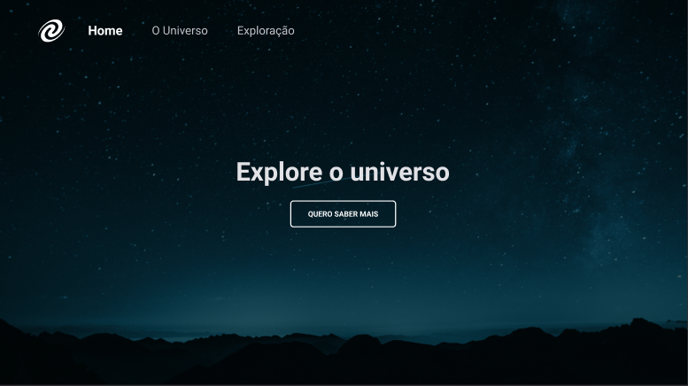

# SPA-Universe

## Site do projeto
-[Site](https://spa-universe-ochre.vercel.app/)

## O que Foi utilizado nesse projeto:

- Conceitos de SPA no Javascript;
- Mapeamento de rotas;
- Assíncronismo e promises;
- Orientação a objetos;
- Classes.

## Layout da aplicação

- [Figma](https://www.figma.com/file/5MPdFCAszPAyUCC4e7DK6o/%5BDesafios-Explorer%5D-SPA-Universe-(Copy)-(Copy)?node-id=104%3A48&t=9HadwR9qDJExCLyt-0)
